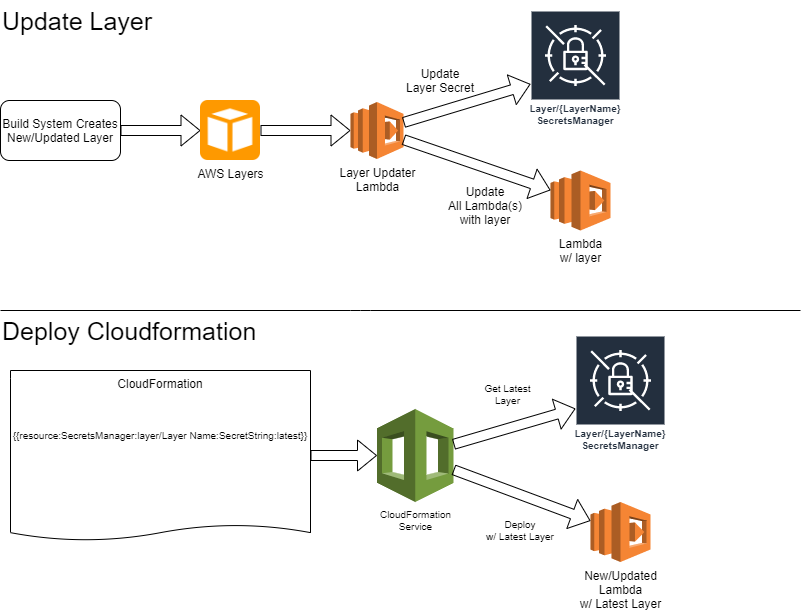

# serverless-plugin-layer-updater
Allows serverless projects to reference the latest version of a layer, with the added ability to update lambda functions automatically to reference a new layer version when one is published.  While this solution is designed to help the serverless framework, it can be deployed for non-serverless framework systems as well (such as the SAM framework).

[](https://shields.io/) [](https://pypi.python.org/pypi/ansicolortags/)

## Design:
The layer-updater uses an automated design to keep all functions up to date.




# Implementing Auto Updater

Clone down the serverless-plugin-layer-updater repository.

```bash
git clone https://github.com/mutual-of-enumclaw/serverless-plugin-layer-updater.git
```

Install the utility into your account, modify samconfig.toml to point at a deployment bucket then run:
``` bash
npm i
npm run deploy
```

Deploy your layer with "auto update" somewhere in the description

```yaml
layers:
    mylayer:
        path: layerPath
        description: This is my layer (auto updates)
```

When the layer deploys, all functions which reference it's prior version will automatically be updated to use the latest version of the plugin
 